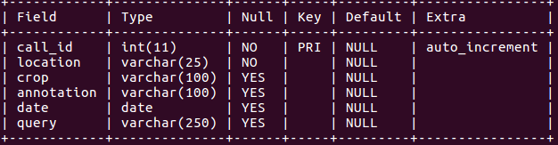

# Business Analytics for Kisan Call Center
## What is Kisan Call Center
[Kisan Call Center](http://mkisan.gov.in/KCC/KCCDashboard.aspx) also known as KCC, is a toll free call center service being run by the government where farmers can call and ask their queries. Agriculture garduates and experts man these call centers. Spread across the country, on an average it receives about 500,000 calls per month or about 60-65 lakh calls per year making it very useful for any analysis.

## Project Objective
Our objective is to derive actionable business intelligence from analysing the KCC data. These are calls directly from the farmers so have the potential of giving us a reliable and timely feedback from the field. So for instance, we can know practically on a real-time basis from the data that incidences of XX pest are increasing for CC crop in SS state. This makes it very useful and the administrative machinery can be activated, ncesssary pesticides can be moved into that area in a timely fashion and further distress can be reduced. It can also serve as a useful tool for us to gain insights into a particular phenomenon. For example, it should be able to tell us that this year, distress among farmers in say Maharashtra was particularly high due to this factor, and then corrective actions may be undertaken. Another possible use case is in using it as a feedback mechanism for various initiatives of the department. So for example, if this year suddenly a larger number of farmers are asking about soil health card, then it confirms that things are moving on well on ground. If after a pest attack, we move pesticides into the area, but still the calls complaining about the pest keep on increasing, it may indicate that something went wrong and the pesticide is not reaching the farmers. 

These are just some of the use cases, the possibilities are infinite.

## Project Structure

* The project uses mysql data to store the database. The schema of the KCCDATA table in MYSQL testDB database is as given below.

* The project is basically a server which runs on a webserver like Tomcat v7. It follows a RESTFUL api structure. Clients can query the server. Clients can query for following things:

	* They can query for details of all the calls made for a combination of certain parameters. A typical URI will look like: 
	
	`http://localhost:8080/KCC?location=LL&crop=CC&annotation=AA&beginDate=BB&endDate=EE` 
	(where BB and EE are in YYYY-MM-DD format). Such a URI will essentially run a SQL query: 
	`Select * from KCCDATA WHERE location='LL' AND crop='CC' AND annotation='AA' AND date BETWEEN 'BB' AND 'EE';` 
	If any query parameter is missing, then all calls for that parameter will be returned. For example, if the URI is: 
	`http://localhost:8080/KCC?location=LL&crop=CC&beginDate=BB&endDate=EE` 
	then the SQL query will be:
	`Select * from KCCDATA WHERE location='LL' AND crop='CC' AND date BETWEEN 'BB' AND 'EE';`
	If beginDate is missing, then all calls on and before endDate will be returned. If endDate is missing, then all calls on or after beginDate will be returned. All these calls will be returned as a JSON Object Array.
	* The client can query for Alerts also. An Alert means something "unusual" happening. For instance, if suddenly there is an unusual increase in calls from cotton farmers of Maharashtra asking about white-fly, it may indicate a white-fly attack there. The client can query for alerts in following ways:
	`http://localhost:8080/KCC/alerts?currentDate=YYYY-MM-DD&alertWindowLength=WW`
	Here currentDate will return alerts based on data till that date. If left blank, it would return alerts as of today. Similarly through alertWindowLength, the client can specify the number of days wide he wants the alert window to be. An alert window is needed due to the seasonal nature of agriculture. If we are early in this year, even if there is nothing unusual, there will be a high proportion of calls related to rabi crops like wheat and mustard. If we compare this year's rabi crop call proportion with the proportion of rabi crop calls in whole of past years, then past years will show a lower proportion because their call data includes calls forr kharif crops as well. So we need an alertWindow. Default length is 45 days which will be used if the client doesn't specify anything in the alertWindowLength parameter. A query like above will return all alerts in the system as on currentDate taking alert window length as WW days.
	* The client can query for crop or location or annotation specific alerts too. A query like:
	`http://localhost:8080/KCC/alerts/locations?currentDate=YYYY-MM-DD&alertWindowLength=WW`
	will return alerts for all locations. 
	`http://localhost:8080/KCC/alerts/locations/{location}?currentDate=YYYY-MM-DD&alertWindowLength=WW`
	will return alerts for a particular location.
	`http://localhost:8080/KCC/alerts/crops?currentDate=YYYY-MM-DD&alertWindowLength=WW`
	will return alerts for all crops. 
	`http://localhost:8080/KCC/alerts/crops/{crop}?currentDate=YYYY-MM-DD&alertWindowLength=WW`
	will return alerts for a particular crop.
	`http://localhost:8080/KCC/alerts/annotations?currentDate=YYYY-MM-DD&alertWindowLength=WW`
	will return alerts for all annotations. 
	`http://localhost:8080/KCC/alerts/annotations/{annotation}?currentDate=YYYY-MM-DD&alertWindowLength=WW`
	will return alerts for a particular annotation.
	* Presently an alert is generated in the following way. The proportion of calls for a particular {location, crop, annotation} combination to the total calls made this year in the alert window legth is calculated. Then for each previous year, the proportion of calls for the same commbination to the total calls made in that year is calculated. Then a weighted average of all these previous years proportions is calculated. If the current year's proportion is greater than a ceiling threshold or lower than  a floor threshold, then an alert is generated. The weights use a lambda decay - the more we go in past, the lesser the importance of data and hence the lower the weight.

* To run the project, clone the repository, open in eclipse as a gradle project. Run the task "gradle eclipseWTP" to build the WAR file. Then Run as --> 1. Run on Server... Select the Tomcat v7 server. Then enter the desired URIs in your browser window and get alerts.